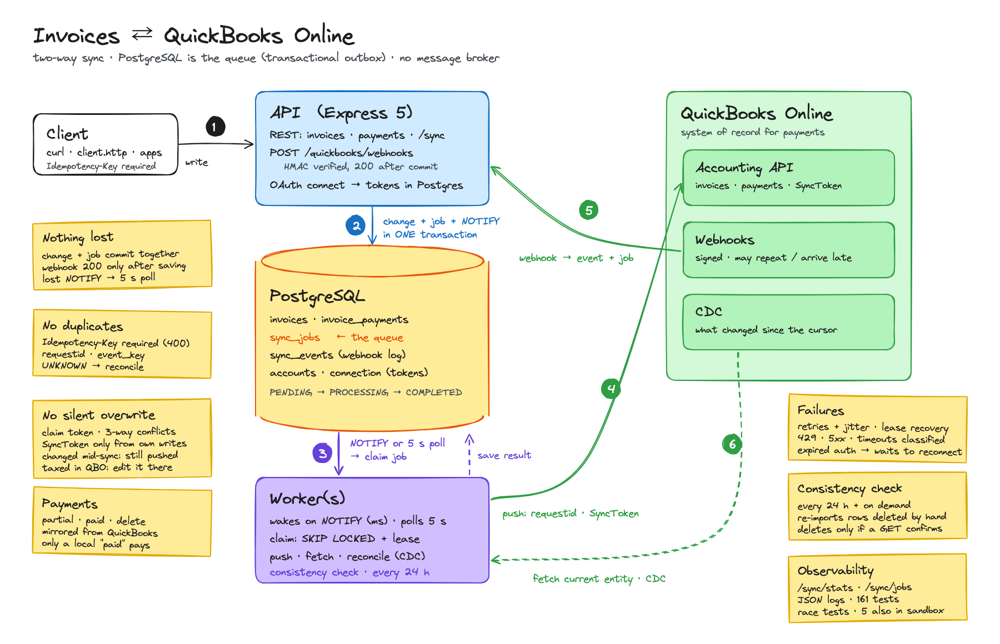
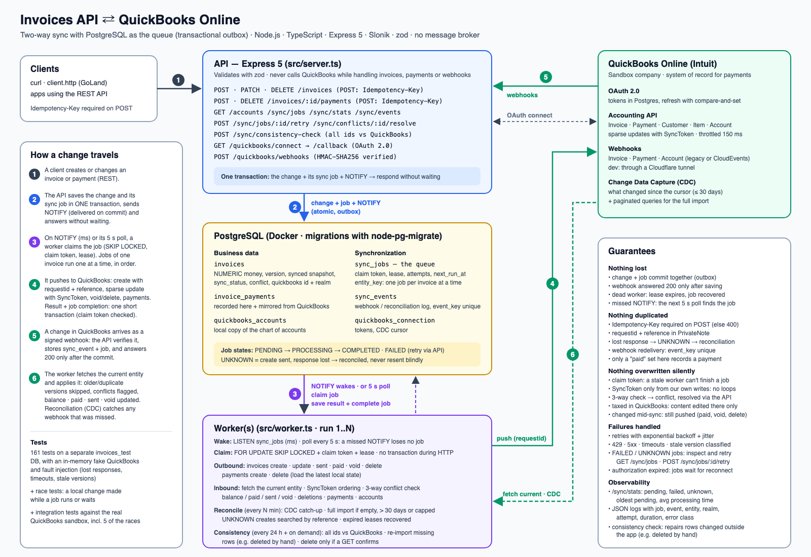

# Invoices API

An invoices API built with TypeScript, Node.js, Express 5, Slonik and PostgreSQL, kept in sync both ways
with QuickBooks Online. PostgreSQL is also the synchronization queue: no message broker.

## Architecture



Hand-drawn version: [`docs/system-design.excalidraw`](docs/system-design.excalidraw) (open it at excalidraw.com to edit), generated by `npm run docs:diagram`. Detailed version:



(Source: [`docs/architecture.svg`](docs/architecture.svg). Demo walkthrough, in Spanish: [`docs/guia-video-entrevista.md`](docs/guia-video-entrevista.md), also as PDF;
`npm run docs:pdf` regenerates the PDF and the PNG after editing the guide or the SVG.)

```
                        ┌──────────────────────────────┐
  curl / client.http ──►│  API (Express)               │◄──── webhooks ───────┐
                        │  invoice + job (+ NOTIFY)    │                      │
                        │  webhook event + job         │                      │
                        └──────────────┬───────────────┘                      │
                                       │ SQL (Slonik)                         │
                        ┌──────────────▼───────────────┐             ┌────────┴──────────┐
                        │  PostgreSQL                  │             │ QuickBooks Online │
                        │  invoices, sync_jobs,        │             │ (Intuit)          │
                        │  sync_events, accounts,      │             └────────┬──────────┘
                        │  quickbooks_connection       │                      │
                        └──────────────▲───────────────┘                      │
                        LISTEN/NOTIFY  │ SQL (Slonik)                         │
                        ┌──────────────┴───────────────┐                      │
                        │  Worker(s)                   │──── push / fetch ───►│
                        │  claim jobs, reconcile,      │◄─── CDC (backup) ────┘
                        │  consistency check           │
                        └──────────────────────────────┘
```

The API and the workers share one PostgreSQL database and never call each other. The API never calls
QuickBooks while handling an invoice or a webhook: it only writes to the database.

| Component | Role |
|---|---|
| **API** (`src/server.ts`) | REST endpoints, the QuickBooks OAuth flow, and the webhook endpoint. Saves each change together with its sync job |
| **Worker** (`src/worker.ts`, one or more) | Claims jobs from `sync_jobs` and syncs them with QuickBooks; recovers jobs of dead workers; reconciles periodically; runs the daily consistency check |
| **PostgreSQL** (Docker) | Invoices, the job queue (`sync_jobs`), received notifications (`sync_events`), the chart of accounts, the QuickBooks tokens. A separate `invoices_test` database for the tests |
| **QuickBooks Online** | Source of truth for payments and accounts; sends webhooks; offers the Change Data Capture (CDC) API used for reconciliation |

### Data flows

1. **Local change → QuickBooks (OUTBOUND).** `POST/PATCH/DELETE /invoices` validates the request (a POST
   needs an `Idempotency-Key`), saves
   the invoice and inserts its sync job **in one transaction**, and returns without waiting for QuickBooks.
   The same transaction sends `NOTIFY`, which Postgres only delivers on commit: a worker wakes up within
   milliseconds, loads the invoice's latest state, and creates, updates, deletes or voids it in QuickBooks.
2. **QuickBooks change → local (INBOUND).** Intuit calls `POST /quickbooks/webhooks`. The API verifies the
   signature on the raw body, validates the payload, and stores each notified entity in `sync_events` with
   its job, in one transaction; it answers `200` only after that commit. A worker then fetches the
   **current** entity from QuickBooks (a notification is never taken as the data) and applies it.
3. **Reconciliation (backup).** Periodically a worker asks the CDC API what changed since its last run and
   queues it like webhook notifications. It also resolves creates whose result is unknown (see below).
4. **Consistency check (anti-entropy).** Once a day (and on demand with `POST /sync/consistency-check`) a
   worker compares every QuickBooks invoice id with the local ones and queues the repairs: re-import what's
   missing locally (e.g. a row deleted by hand), delete locally what a direct GET confirms is gone.
5. **Connecting.** `/quickbooks/connect` → Intuit login → `/callback`, which saves the tokens in Postgres.
   Every process reads them from there; a refresh (an HTTP call) happens outside any transaction and is
   saved with a compare-and-set, so concurrent refreshes don't overwrite each other. Each request uses its
   own OAuth client, so concurrent requests never use each other's token.

### Code layers

Each module has one job, and dependencies only point downwards:

| Layer | Modules | Responsibility |
|---|---|---|
| Entry points | `invoices.router`, `accounts.router`, `quickbooks.router`, `quickbooks.webhooks`, `sync.router`, `worker` | Validate input (zod), call the layer below, shape the response |
| Sync | `sync.processor` (runs a job, error handling), `sync.outbound`, `sync.inbound`, `sync.reconcile`, `sync.consistency`, `sync.conflicts`, `quickbooks.duplicates` | The synchronization rules: the only modules that combine local data with QuickBooks data |
| Data access | `sync.repository` (queue, events, `enqueueInvoicePush`), `invoices.repository`, `payments.repository`, `accounts.repository` | SQL. The sync modules keep the SQL of their own short transactions next to the logic |
| Infrastructure | `db.ts`, `quickbooks.client`, `quickbooks.mapping`, `errors`, `money`, `logger`, `faults` | Slonik pool; OAuth, tokens and QuickBooks HTTP calls (the only module talking to QuickBooks); pure mapping and the sync rules that need no I/O (`statusLeftToPush`, `matchesQuickBooks`, `syncedStatus`); error classification; logging; fault injection for tests |

### Key decisions

| Decision | Why | Trade-off |
|---|---|---|
| **PostgreSQL as the queue** (`sync_jobs`, transactional outbox) instead of RabbitMQ/Kafka | The change and its job commit atomically, so nothing is lost or sent without being saved; no second system to run, back up or keep consistent | Throughput is bounded by one database (fine for thousands of jobs per minute); workers poll as a fallback |
| **`NOTIFY` from application code + polling** | Jobs start within milliseconds; polling covers notifications missed while a worker was down. No triggers; sent only when a job was actually added | Needs a dedicated connection per worker for `LISTEN` |
| **`Idempotency-Key` required** on every POST that creates something (invoices, payments) | A client retrying after a timeout gets what the first attempt created (`200`), never a duplicate. Optional, it would protect everyone but the client that forgets it, which is exactly the one that duplicates an invoice | Clients must generate and keep a key per request (`400` without it); a client that makes a new key on each retry still duplicates (`GET /quickbooks/duplicates` finds those) |
| **Claim token + lease** per job, no transaction during HTTP | A slow or dead worker can't block the database, and can't finish a job someone else took over | Leases must be longer than the slowest job (default 5 minutes) |
| **Jobs of one entity run one at a time, in order** | An inbound and an outbound job can't overwrite each other's work on the same invoice | An entity waiting on a retry waits for it |
| **Worker loads the latest state**, the job only names the entity | Several quick edits become one QuickBooks update; stale payloads are never replayed | One extra read per job |
| **UNKNOWN + reconciliation** for creates without a response | No blind resend, no duplicate invoice | A create can wait minutes to be confirmed |
| **Three-way conflict detection** (last synced snapshot vs local vs QuickBooks) | Concurrent changes are flagged instead of silently overwriting financial data | Someone must resolve conflicts (`POST /sync/conflicts/:id/resolve`) |
| **Periodic consistency check** comparing all ids, besides webhooks and CDC | Catches what change notifications can't: rows deleted by hand, restores from old backups, changes older than CDC's 30 days. Repairs go through the queue; a deletion needs a direct GET to confirm it | One paginated query per run (only `Id, SyncToken`); drift can take up to a day to be repaired, or run it on demand |
| **Sales tax isn't modelled**: an invoice taxed in QuickBooks is read-only here in its content | The local model is one line with one amount; pushing it over taxed lines would change the total, and the amounts would never match (endless conflicts) | Taxed invoices are edited in QuickBooks (status, payments and deletion still sync); modelling lines would be the next step |
| **Money as NUMERIC**, decimal strings in the API | Exact amounts, like QuickBooks'; never JS floats | Clients send `"1500.00"`, not `1500` |
| Raw SQL with Slonik, no ORM | `FOR UPDATE SKIP LOCKED`, `ON CONFLICT`, leases are explicit; queries are parameterized and validated with zod | More SQL by hand |

**When a message broker would make sense:** many services consuming the same events (fan-out), event
volume beyond what one Postgres comfortably handles (sustained tens of thousands of messages per second),
replaying event history (Kafka), or cross-region delivery. Even then, the outbox table stays: a relay would
publish committed rows to the broker, so the database write and the message still can't diverge.

### What would change for production

- **Encrypt the QuickBooks tokens** at rest (stored in plain text).
- **Multiple companies**: the schema is already scoped by `realm_id`; the connection table and the OAuth flow would store one row per company.
- **Multiple API instances**: the OAuth `state` is kept in memory; it would move to the database or a session store.
- **Lease heartbeats** for jobs that can take longer than the lease.
- **Alerts** on the metrics below (failed/unknown jobs, oldest pending job) and on webhook errors.
- **Retention**: archive completed jobs and processed events after some days.

## Run it

Requires Node 22+ (`nvm use`) and Docker.

```bash
npm install
npm run db:up      # starts Postgres on localhost:5433 with empty main and test databases
npm run db:migrate # creates/updates the tables in the main database
npm run dev        # API on http://localhost:3000 (runs the .ts files with tsx, reloads on change)
npm run dev:worker # sync worker, in a second terminal (several can run at once)
npm test           # tests against the separate invoices_test database (migrates it first)
npm run test:sandbox   # integration tests against the real QuickBooks sandbox (see Testing)
npm run db:test:reset  # recreate the test database from scratch
npm run typecheck  # tsc --noEmit

npm run build && npm start   # compile to dist/ and run with plain node (and `npm run worker`)
```

`client.http` has ready-to-run requests for every endpoint: the "create locally, see it synced" flow, a
duplicate-invoice test (D1–D7), a payments walkthrough with assertions (P1–P13: partial payment, retry with
the same Idempotency-Key, over-payment, mark as paid, delete a payment), a signed webhook simulation (W1–W2)
and the sync operations. Open it in
GoLand/IntelliJ/WebStorm (JetBrains HTTP Client, built in) and click ▶ next to a request.

### Configuration

Environment variables in `.env` (see `.env.example`), loaded by the npm scripts:

| Variable | Default | Meaning |
|---|---|---|
| `DATABASE_URL`, `PORT` | local Docker, `3000` | Database and API port |
| `QBO_CLIENT_ID`, `QBO_CLIENT_SECRET`, `QBO_ENVIRONMENT`, `QBO_REDIRECT_URI` | | Intuit app credentials (`sandbox` or `production`) |
| `QBO_WEBHOOK_VERIFIER_TOKEN` | | Verifies Intuit's webhook signatures; the endpoint answers `503` without it |
| `SYNC_POLL_INTERVAL_SECONDS` | `5` | Fallback polling for jobs (NOTIFY normally wakes the worker at once) |
| `SYNC_RECONCILE_INTERVAL_SECONDS` | `300` | How often to reconcile with CDC and resolve UNKNOWN creates |
| `SYNC_JOB_LEASE_SECONDS` | `300` | How long a worker owns a claimed job |
| `SYNC_MAX_ATTEMPTS`, `SYNC_RETRY_BASE_SECONDS` | `8`, `10` | Retries before FAILED; base of the exponential backoff (capped at 15 minutes) |
| `SYNC_UNKNOWN_GRACE_SECONDS` | `120` | Wait before searching QuickBooks for an UNKNOWN create |
| `SYNC_CONSISTENCY_INTERVAL_HOURS` | `24` | How often the worker runs the full consistency check (also at start) |
| `QBO_MIN_REQUEST_INTERVAL_MS` | `150` | Spacing between QuickBooks requests per process (limit: 500/minute per company) |
| `LOG_LEVEL` | | `silent` turns logs off (used by the tests) |

## Database migrations

The schema lives in `migrations/` as plain SQL files, run in order by
[node-pg-migrate](https://salsita.github.io/node-pg-migrate/). Applied migrations are recorded in the
`pgmigrations` table, so each runs once per database.

```bash
npm run db:migrate:create -- add-invoice-notes   # new file migrations/<timestamp>_add-invoice-notes.sql
# write the change under "-- Up Migration" and how to undo it under "-- Down Migration"
npm run db:migrate                               # apply pending migrations to the main database
npm run db:migrate:down                          # undo the last one
```

Each migration runs in a transaction, so a failing one leaves nothing half applied. `npm test` applies
pending migrations to the test database automatically.

## Endpoints

| Method | Path | Description |
|---|---|---|
| GET | `/invoices` | List invoices (`?status=paid&limit=20&offset=0`) |
| GET | `/invoices/:id` | Get one invoice |
| POST | `/invoices` | Create an invoice. **Requires** an `Idempotency-Key` header (e.g. a UUID; `400` without it; the same key again returns the original invoice with `200`) |
| PATCH | `/invoices/:id` | Partially update an invoice (`"status": "void"` voids it in QuickBooks too). `409` on a voided invoice, when un-paying a paid one, or when changing the content of an invoice taxed in QuickBooks (checked in the `UPDATE` itself, so it can't race with a void arriving meanwhile) |
| DELETE | `/invoices/:id` | Delete an invoice (soft delete until QuickBooks confirms the deletion, then removed) |
| POST | `/invoices/:id/payments` | Record a payment, full or partial: `{"amount": "30.00", "paid_on": "2026-09-28"}`. **Requires** an `Idempotency-Key` header, like `POST /invoices`; a key already used for another invoice's payment is rejected (`409`) |
| GET | `/invoices/:id/payments` | The invoice's payments, recorded here or in QuickBooks, with their sync status |
| DELETE | `/invoices/:id/payments/:paymentId` | Delete a payment, here and in QuickBooks (`409` if it also pays other invoices) |
| GET | `/accounts` | Chart of accounts (local copy, synced from QuickBooks) |
| GET | `/sync/stats` | Queue metrics |
| GET | `/sync/jobs` | Sync jobs (`?status=FAILED`, `?invoice_id=75`, `&limit=50`) |
| POST | `/sync/jobs/:id/retry` | Retry a FAILED or UNKNOWN job |
| GET | `/sync/events` | Notifications received from QuickBooks |
| POST | `/sync/conflicts/:invoiceId/resolve` | Resolve a conflict: `{"keep": "local"}` or `{"keep": "remote"}` |
| POST | `/sync/consistency-check` | Compare every QuickBooks invoice with the local ones and queue the repairs (`?repair=false`: report only) |
| POST | `/quickbooks/webhooks` | Intuit's webhook notifications |
| GET | `/quickbooks/connect`, `/callback`, `/quickbooks/status` | Connect a QuickBooks company, check the connection |
| GET | `/quickbooks/invoices`, `/quickbooks/accounts`, `/quickbooks/company-info`, `/quickbooks/duplicates` | Read live from QuickBooks; duplicate check |

```bash
curl -X POST localhost:3000/invoices -H 'content-type: application/json' -H "Idempotency-Key: $(uuidgen)" \
  -d '{"customer_name":"Acme Corp","amount":"1500.00","due_date":"2026-12-31"}'
```

**`Idempotency-Key` (required on `POST /invoices` and `POST /invoices/:id/payments`).** Send a new unique
value (a UUID) for each invoice or payment you create, and **the same value when retrying** that request
(after a timeout or a lost response). The first request creates it (`201`); a retry with the same key returns
what was created then (`200`), without creating or queuing anything. It's stored in a unique column, so two
concurrent retries also get one invoice. Without the header (or empty):

```
400 {"error": "The Idempotency-Key header is required (e.g. a new UUID per request; reuse it when retrying)"}
```

Invoice fields: `customer_name`, `amount` (decimal string, up to 2 decimals), `currency` (3 letters,
default `USD`), `status` (`draft` | `sent` | `paid` | `void`, all synced with QuickBooks: sent = marked as sent,
paid = a payment for the whole balance, void = voided), `due_date`
(`YYYY-MM-DD`). Read-only: `balance` (from QuickBooks payments; equal to `amount` until the invoice reaches QuickBooks),
`taxed_in_quickbooks` (see "Sales tax" below), `quickbooks_id`, `sync_status`
(`pending` | `synced` | `conflict` | `unknown` | `failed`), `sync_error`, `sync_conflict`.

Errors: `400` validation, `404` not found, `409` state conflicts, `500` anything unexpected.

## QuickBooks setup

Put your Intuit app credentials in `.env`; `http://localhost:3000/callback/` (with the trailing slash) must be
a Redirect URI in the Intuit app. Then open `http://localhost:3000/quickbooks/connect` in a browser and
authorize a sandbox company. The tokens are saved in Postgres, so this is needed once.

### Webhooks

Intuit needs a public HTTPS URL, so for local development expose the API with a
[Cloudflare quick tunnel](https://developers.cloudflare.com/cloudflare-one/connections/connect-networks/do-more-with-tunnels/trycloudflare/)
(free, no account needed):

1. `brew install cloudflared`, then `cloudflared tunnel --url http://localhost:3000` and copy the
   `https://<random-words>.trycloudflare.com` URL. Keep it running; `<url>/health` should return `{"status":"ok"}`.
2. On developer.intuit.com, go to your app, then **Webhooks** (Development): set the endpoint to
   `https://<random-words>.trycloudflare.com/quickbooks/webhooks` and select **Invoice**, **Payment** and **Account**.
3. Copy the **Verifier Token** into `.env` as `QBO_WEBHOOK_VERIFIER_TOKEN` (and into
   `http-client.private.env.json` for the simulation) and restart `npm run dev`.

The tunnel URL changes whenever `cloudflared` restarts; update it in the portal. Both of Intuit's payload
formats are accepted (the original `eventNotifications` and CloudEvents), with several entities per
notification. The API logs `sync.webhook.event` for each one (`enqueued`, `duplicate` or `ignored`) and
`sync.webhook.rejected` for a bad signature.

**Simulating a webhook** without a tunnel: `client.http` requests W1–W2 send a notification signed like
Intuit's. Run them with the `dev` environment; the token comes from `http-client.private.env.json`
(gitignored) and must match `QBO_WEBHOOK_VERIFIER_TOKEN`.

## Synchronization in detail

### The worker loop: NOTIFY and polling

Each worker runs one loop (`main` in `src/worker.ts`):

```
loop:
  recover expired leases
  reconcile with QuickBooks (CDC)            if SYNC_RECONCILE_INTERVAL_SECONDS passed
  consistency check                          if SYNC_CONSISTENCY_INTERVAL_HOURS passed
  claimNextJob → processJob, until none is ready
  waitForWork(SYNC_POLL_INTERVAL_SECONDS)    ← a NOTIFY ends the wait early
```

- **NOTIFY gives the latency, polling gives the guarantee.** `waitForWork` is a timer (5 s by default) that a
  `NOTIFY sync_jobs` cuts short, so a new job starts within milliseconds. But a notification isn't durable:
  one sent while the worker is down or reconnecting is lost. The job isn't, since it's a row in `sync_jobs`, and
  the next pass of the loop finds it. A notification arriving while the worker is busy makes the next wait
  return at once. When the `LISTEN` connection drops, the worker reconnects and checks the queue right away.
- **The poll is one query** (`claimNextJob` in `src/sync.repository.ts`), served by the partial index
  `sync_jobs_runnable_idx` on pending jobs, so polling every few seconds costs next to nothing.
- **Polling QuickBooks** is the same idea in the other direction: webhooks give the latency, and the CDC
  reconciliation (see Reconciliation) catches any notification that was missed.

### Job lifecycle

```
PENDING ──claim──► PROCESSING ──► COMPLETED
   ▲                   │
   ├── retry (backoff) ┤
   │                   ├──► FAILED ─── POST /sync/jobs/:id/retry ──► PENDING
   │                   └──► UNKNOWN (create result unknown)
   │                              │
   └──── not in QuickBooks ◄──────┴── reconciliation ──► COMPLETED (found) / FAILED (ambiguous)
```

- **Claiming**: `UPDATE ... WHERE id = (SELECT ... FOR UPDATE SKIP LOCKED LIMIT 1)` sets `PROCESSING`, a new
  random `claim_token`, `locked_by` and `lease_expires_at`, and counts the attempt. Several workers can
  claim at once and never get the same job.
- **Ownership**: every later update of the job checks its `claim_token`. If a worker is slower than its lease,
  another worker may take the job over, and the first one can no longer complete it (its changes roll back),
  nor record a failure: its error then changes neither the job nor the invoice or event.
- **Recovery**: each worker loop returns jobs with an expired lease to `PENDING`, or to `UNKNOWN` if a create
  may already have been sent (`create_sent_at`), or to `FAILED` after the last attempt (its notification in
  `sync_events` is marked failed too).
- **Entity-level coordination**: jobs share an `entity_key` (`invoice:<local id>`). A job is only claimed if no
  other job of the same entity is `PROCESSING` or `UNKNOWN` and no older one is still `PENDING`. So an invoice's
  inbound and outbound jobs run one at a time, in order. Before a QuickBooks invoice is linked to a local one,
  its jobs use `qbo-invoice:<realm>:<id>`; see "before the mapping exists" below.
- **No transaction is open during an HTTP call**: claim (short transaction) → talk to QuickBooks → save the
  result and complete the job (one short transaction, rows locked with `FOR UPDATE`).

### Error handling

| Error | Class | What happens |
|---|---|---|
| Timeout, connection reset, 5xx **after sending a create** | ambiguous | Job `UNKNOWN`; reconciliation decides, the create is never resent blindly |
| Timeout, connection reset, 5xx (other requests) | `timeout`, `network`, `server` | Retried with exponential backoff and jitter |
| `429` rate limited | `rate_limited` | Retried after at least a minute |
| Stale `SyncToken` (QuickBooks fault 5010) | `version_conflict` | Retried; the next attempt fetches the new version (and checks for conflicts) |
| Entity not found | `not_found` | Retried: a failed GET is never taken as proof of deletion |
| Validation fault (e.g. invalid reference) | `validation` | `FAILED` right away |
| Not connected, token revoked (401/403), refresh token expired or revoked (`invalid_grant`) | `not_connected`, `auth` | Waits, without using up attempts; connecting wakes these jobs |
| Our bugs, database errors | `internal` | Retried, then `FAILED` for inspection |

Backoff: `base × 2^(attempt−1)`, capped at 15 minutes, with "equal jitter" (between half and all of it) so
failed jobs don't retry in lockstep. Each process also spaces its QuickBooks requests (150 ms) to stay under
QuickBooks' 500 requests/minute per company.

### OUTBOUND (local → QuickBooks)

The worker loads the invoice's current state (the job only names the invoice), then:

- **Already synced** (`version <= synced_version`): nothing to do. Quick successive edits share one update.
- **Create**: finds or creates the customer, records `create_sent_at` on the job, and posts the invoice with a
  `requestid` idempotency key and the stable reference `local-invoice-<id>-<created_at>` in its PrivateNote.
- **Update**: fetches the QuickBooks invoice first. If it already matches, nothing is sent. If it changed in
  QuickBooks since the last sync *and* differs from the local version, a **conflict** is registered instead of
  overwriting it, unless the local content didn't change (e.g. only the status did): then QuickBooks' content
  is taken first, as the inbound job would, and the status is pushed against it. Otherwise a sparse update is
  sent with QuickBooks' current `SyncToken`.
- **Delete / void**: a local delete (a soft delete until synced) deletes the QuickBooks invoice, or **voids** it
  if payments are applied (QuickBooks keeps the payment history). `PATCH status=void` voids it. If it's already
  gone, it's done. When QuickBooks then notifies the deletion, the local row is removed. An invoice deleted
  before it ever reached QuickBooks is removed right away, with no QuickBooks call.
- **Voided invoices** (here or in QuickBooks) aren't editable in QuickBooks: only a deletion is pushed, and
  `PATCH` on a voided invoice is rejected (`409`).
- **Payments** (`POST /invoices/:id/payments`, full or partial): saved with their job in one transaction; the
  amount can't exceed what's left to pay: the invoice's current amount (including a local change not synced
  yet) minus its payments, synced or not; nothing if it was marked paid locally (its own job pays the balance).
  The invoice row is locked, so concurrent payments can't overpay, and a concurrent retry with the same
  `Idempotency-Key` gets the same payment. Amounts must be above 0. The worker creates a QuickBooks Payment applied to the invoice, after the invoice's own jobs
  (same entity key), then takes the new balance from QuickBooks (if that read fails, the payment is still saved
  as synced, since it exists, and the balance comes with QuickBooks' notification). Like invoice creates, a payment is never sent
  twice: it carries a stable reference (`local-payment-<id>-<created_at>`, as requestid and in its PrivateNote),
  and a lost response makes the job UNKNOWN until reconciliation searches the customer's payments for it.
  A payment whose invoice was deleted before it was sent is never sent (it's removed with the invoice).
- **Deleting a payment** (`DELETE /invoices/:id/payments/:paymentId`): marked as deleted and queued in one
  transaction, after the payment's create job. The worker deletes it in QuickBooks, removes the row and takes
  the restored balance from QuickBooks (a paid invoice goes back to `sent`). A payment deleted before it reached
  QuickBooks is never sent. Deleting is idempotent (a retry that finds it gone from QuickBooks is done), so it
  needs no UNKNOWN state. Payments made in QuickBooks can be deleted from here as well, except one that also
  pays other invoices (`409`: deleting it would change those too; delete it in QuickBooks).
- **Sent status**: a local invoice created or changed to `sent` is marked as sent in QuickBooks
  (`EmailStatus = EmailSent`). "Sent" only moves forward: going back to `draft` isn't pushed.
- **Paid status**: a local invoice created or changed to `paid` gets a payment in QuickBooks for its whole
  balance. Only a `paid` set here counts (the local balance, last read from QuickBooks, is still above 0): a
  `paid` that came from QuickBooks is never paid again, e.g. after its payment was deleted there or the amount
  was raised (the invoice goes back to `sent` instead). The balance is read right before paying and the payment has its own `requestid`, so a retry (e.g.
  after a timeout) never records it twice; the payment is listed in `/invoices/:id/payments`. Setting the
  status back from `paid` is rejected (`409`): delete the payment instead (here or in QuickBooks).

The QuickBooks id, `SyncToken`, snapshot and the job completion are saved in one transaction.

**Changes made while a job runs.** The result is saved with the version that was pushed (`synced_version`).
If the invoice changed meanwhile, it stays `pending` and another job pushes the latest state: every outbound job
that ends checks the invoice's version again (locking the row, so it waits for a change still being committed)
and queues that job itself, since the API may not have queued one (it saw this job still waiting). Until then:

- a local `paid` newer than what QuickBooks has stays `paid`, even though QuickBooks still shows a balance
  (`syncedStatus`); its job records the payment;
- a version is only recorded as synced without pushing it when QuickBooks already has **everything** it says:
  the same content, no deletion, and no status left to push (`matchesQuickBooks`). "Status left to push" is one
  rule used everywhere (`statusLeftToPush`): `paid` while QuickBooks shows a balance, `sent` not sent there,
  `void` not voided there. This
  matters when a create that ended `UNKNOWN` is resolved, by reconciliation or by a notification: a delete or
  a `paid` made meanwhile is still pushed;
- the `SyncToken` and the synced snapshot only come from our own write (or the version found matching), never
  from a read made afterwards, e.g. after recording a payment: that read may carry an edit made in QuickBooks
  meanwhile, which only the inbound job applies (it would skip it as already applied). Such a read only gives
  the balance and status.

Each of these races has a test that reproduced it before the fix (`test/sync.races.test.ts`).

**Ambiguous create** (QuickBooks created the invoice but the response was lost): the job becomes `UNKNOWN`
and blocks the invoice's other jobs. After `SYNC_UNKNOWN_GRACE_SECONDS`, reconciliation searches the
customer's invoices created around that time for the reference: **one** match → linked, job completed;
**none** → created again (with the same `requestid`, so QuickBooks can't duplicate it); **several** → `FAILED`
for manual investigation. A webhook for that invoice resolves it too (see below).

### INBOUND (QuickBooks → local)

The worker fetches the current entity from QuickBooks, so duplicate, stale or out-of-order notifications
can't overwrite newer data:

- **Same or older `SyncToken`** than the one stored: skipped. This is also what prevents sync loops: after a
  push the new `SyncToken` is stored, so the notification of our own change is skipped.
- **Three-way comparison** with the last synced snapshot (the content both sides agreed on):

  | Local changed? | QuickBooks changed? | Result |
  |---|---|---|
  | no | yes | QuickBooks' version applied |
  | yes | no | kept; its outbound job pushes it |
  | yes | yes, same change | nothing to do |
  | yes | yes, differently | **conflict**: nothing overwritten, both versions stored in `sync_conflict` |

  An invoice in conflict whose QuickBooks version ends up equal to the local one converges: the conflict is
  cleared, and a status changed during the conflict (which queued no job then) gets a job to push it.

- **Balance and paid status** come from QuickBooks. A payment received in QuickBooks refreshes the invoices it
  pays (`balance`, `status = paid` when nothing is left); deleting the payment there takes them back to `sent`.
  A local `paid`, `sent` or `void` that hasn't been pushed yet isn't reverted by a notification arriving
  before the push: when QuickBooks' content is taken, the invoice stays `pending` until its job pushes the status.
- **Payments made in QuickBooks** are listed in `invoice_payments` too: one row per local invoice the payment
  pays, with that invoice's share (a QuickBooks payment can pay several invoices, and several of its lines can
  pay the same invoice: they're added up), updated when the payment
  changes and deleted when it's deleted there. A payment recorded here and notified back links its existing
  row (by the reference in its PrivateNote), even if the notification is faster than the worker saving its id,
  so it's never listed twice. The full import brings the existing payments too.
- **Sent status**: an invoice emailed or marked as sent in QuickBooks (`EmailStatus = EmailSent`) turns a local
  `draft` into `sent`. Marking it as sent in the QuickBooks app doesn't change its `SyncToken`, so this is
  checked even for a version we already have.
- **Deleted in QuickBooks → deleted locally**: the row is removed (`DELETE`, no soft delete). Only a delete
  notification does this; a failed GET never counts as a deletion. Unpushed local changes can't be synced to a
  deleted invoice, so they're discarded, and the job's result records which fields they were (plus a
  `sync.inbound.deleted_with_local_changes` log). An update notification that can't find the invoice is
  retried, unless a later delete notification for it exists (then it's superseded).
- **Voided in QuickBooks → voided locally**: `status = void`, `voided_at` set, `balance = 0.00`; the row stays
  and keeps the invoiced amounts (QuickBooks zeroes them). QuickBooks has no void status field, so a void is
  recognized from the webhook's `Void` operation or from the invoice itself (amounts zeroed and a PrivateNote
  starting with `Voided`, checked against the real sandbox), which also covers reconciliation and imports.
  A void wins over unpushed local changes, and a voided invoice's local edits aren't pushed.
- **Before the mapping exists**: a QuickBooks invoice carrying our reference in its PrivateNote is **linked** to
  the local invoice that created it, never imported as a copy. If that invoice's create job is still running,
  the notification is deferred a few seconds (without counting an attempt); if the create ended `UNKNOWN`,
  this resolves it. It's only marked synced if QuickBooks has everything the local invoice says
  (`matchesQuickBooks`); a change made after the create, like a deletion, is still pushed.
- **Accounts**: the local copy is inserted, updated (unless the `SyncToken` is older; the same one is applied too,
  since QuickBooks keeps it when the balance moves, checked in the sandbox) or removed.

### Sales tax

The local model is one invoice = one line with one amount; tax isn't modelled. QuickBooks can add sales tax
(the sandbox company uses it, and `TotalAmt` includes it). An invoice with tax in QuickBooks
(`TxnTaxDetail.TotalTax > 0`) is marked `taxed_in_quickbooks`, and its content (amount with tax, customer, due
date) is QuickBooks': it follows QuickBooks and can't be edited here (`409`, "change it in QuickBooks"), since
pushing one untaxed line would replace its taxed lines and change the total. Its status, payments and
deletion still sync both ways. Without this, the amount we push (100) and what QuickBooks returns (108) would
never match: every QuickBooks edit would become a conflict.

### Conflicts

An invoice in `conflict` isn't synced until resolved; `sync_conflict` holds the local, QuickBooks and base
versions, the changed fields and the reason. `POST /sync/conflicts/:invoiceId/resolve` with:

- `{"keep": "remote"}`: the local invoice takes QuickBooks' content. Anything else changed locally during the
  conflict (a deletion, a void, "paid", "sent") is still pushed: an outbound job checks it against QuickBooks.
- `{"keep": "local"}`: QuickBooks' version becomes the base and the local version is pushed as a normal change
  (if QuickBooks changed again meanwhile, that's a new conflict).

A deletion or a void in QuickBooks is never a conflict: it wins (see INBOUND). Neither is a content change made
only in QuickBooks while the local change was something else (e.g. marked as paid): the worker takes QuickBooks'
content and pushes the status against it.

### Reconciliation

Every `SYNC_RECONCILE_INTERVAL_SECONDS` (and when a worker starts), a worker reconciles with QuickBooks:

- **Full import, only when needed** (imported invoices get their status from QuickBooks: `paid` if nothing
  is left to pay, `sent` if QuickBooks sent it, otherwise `draft`): on the first run after connecting a company (connecting resets the
  cursor), or when there's no local invoice of that company but QuickBooks has some, e.g. the local data was
  wiped (a company without invoices just uses CDC). Every QuickBooks
  invoice is read with a paginated query and applied like a notification: invoices this system created are
  linked (never duplicated), versions already present are skipped, and balances/paid status come along. The
  chart of accounts is imported the same way when its table is empty.
- **Otherwise, only changes**: QuickBooks' CDC API lists the invoices, payments and accounts changed since
  the cursor (QuickBooks' own timestamp, never moving backwards). They're recorded in `sync_events`
  (`source = reconciliation`) with a job, through the same code as webhooks; changes already recorded are
  skipped by their `event_key` (built from `LastUpdatedTime`, since some changes keep the `SyncToken`), so it's
  safe to rerun.

CDC only goes back 30 days and returns at most 1000 objects per entity. After a longer stop, or when CDC returns
its maximum (more may have changed), a full import runs instead (accounts included), followed by the consistency
check: the import brings what changed but not what was deleted, and the check queues those deletions (each
confirmed with a GET).

So after stopping the API and the worker, starting them again catches up on everything that changed in
QuickBooks meanwhile, and an empty database is filled from QuickBooks.

### Consistency check

CDC only reports what *changed* in QuickBooks. A row deleted by hand in the database, a restore from an old
backup or a change older than 30 days go unnoticed by it. So every `SYNC_CONSISTENCY_INTERVAL_HOURS` (and when
it starts) the worker compares **every** QuickBooks invoice (only `Id` and `SyncToken`, paginated) with the local
invoices linked to them, and repairs the differences through the queue, like notifications:

- **In QuickBooks, missing locally** (e.g. deleted with SQL): re-imported, with its payments.
- **Linked locally, not in QuickBooks**: confirmed with a direct GET first ("Object Not Found"); only then
  deleted locally. The local list is read before QuickBooks', so an invoice being created meanwhile isn't
  mistaken for a missing one.

`POST /sync/consistency-check` runs it on demand and returns the report (`?repair=false` only reports). Deleting
through the API (`DELETE /invoices/:id`) is still the way to delete an invoice everywhere; people shouldn't have
write access to the production database.

### Duplicates

| Where | Protection |
|---|---|
| Client retries `POST /invoices` | Required `Idempotency-Key` header (`400` without it), unique column; a retry with the same key returns the original invoice |
| Webhook redelivered by Intuit | `sync_events.event_key` is unique: CloudEvents id, or entity + operation + `lastUpdated` |
| Create retried or response lost | `requestid` + UNKNOWN reconciliation by the PrivateNote reference (invoices and payments) |
| Client retries `POST /invoices/:id/payments` | Required `Idempotency-Key` header (`400` without it), unique column; a retry with the same key returns the original payment |
| Two workers, same job | `FOR UPDATE SKIP LOCKED` + claim token |
| Inbound and outbound on the same invoice | one job per entity at a time |
| Same QuickBooks invoice twice | unique `(quickbooks_realm_id, quickbooks_id)` |

`GET /quickbooks/duplicates` verifies it: QuickBooks invoices created more than once from the same local
invoice, and local invoices with the same customer, amount and due date.

## Operations

- `GET /sync/stats`: pending, processing, failed and unknown jobs, jobs retried, total retries, oldest pending
  job (seconds), average processing time over the last hour.
- `GET /sync/jobs?status=FAILED` (or `UNKNOWN`): each job has `last_error`, `last_error_class`, `attempts`,
  `locked_by`, and the invoice as `local_invoice_id` and `quickbooks_id`. (`entity_id` is the local id for
  OUTBOUND jobs but the QuickBooks id for INBOUND ones.) After fixing the cause: `POST /sync/jobs/:id/retry`.
- `GET /sync/jobs?invoice_id=75`: an invoice's whole sync history, both directions, by its local id.
- `GET /sync/events`: what QuickBooks notified, and whether it was processed, ignored or failed.
- `POST /sync/consistency-check?repair=false`: how many invoices QuickBooks and the local database have, and
  which ones are missing on either side, without changing anything. Without `repair=false`, the repairs are
  queued (`sync_events.source = reconciliation`, `event_key` starting with `consistency:`).
- **Logs**: one JSON object per line (`sync.job.completed`, `sync.job.retry_scheduled`, `sync.job.failed`,
  `sync.job.unknown`, `sync.webhook.event`, `sync.consistency.done`, ...) with job id, event id, entity, realm, direction, attempt,
  duration and error class. Tokens and credentials are never logged.

The same metrics in SQL:

```sql
SELECT status, count(*) FROM sync_jobs GROUP BY status;                          -- jobs by status
SELECT now() - min(created_at) FROM sync_jobs WHERE status = 'PENDING';          -- oldest pending job
SELECT avg(duration_ms) FROM sync_jobs
WHERE status = 'COMPLETED' AND completed_at > now() - interval '1 hour';         -- average processing time
SELECT entity_key, attempts, last_error_class, last_error FROM sync_jobs
WHERE attempts > 1 ORDER BY attempts DESC LIMIT 20;                              -- most retried
```

## Testing

`npm test` runs everything against `invoices_test` (never the main database), with an in-memory fake
QuickBooks (`test/helpers.ts`) to reproduce what the real sandbox can't reliably do: lost responses,
timeouts, stale versions. Failures at exact points are injected with `src/faults.ts` (e.g.
`qbo.create.response-lost`: QuickBooks created the invoice, then the response is lost). Covered:

- atomic invoice + job creation, and atomic webhook event + job creation (with a fault between the inserts)
- duplicate webhook delivery, invalid signatures, events of another company
- concurrent workers, entity-level ordering, retry scheduling and backoff, expired lease recovery, a stale
  worker unable to complete a reclaimed job or to mark it failed after another worker synced it
- QuickBooks authorization: an expired or revoked refresh token (`invalid_grant`) waits for a new connection
  instead of using up the jobs' attempts; concurrent requests never use each other's token
  (`test/quickbooks.client.test.ts`)
- QuickBooks version conflicts, out-of-order events, sync-loop prevention
- ambiguous create: UNKNOWN, no resend, reconciliation found / not found / ambiguous
- reconciliation: full import when needed, CDC otherwise, and a full import when CDC can't be trusted (cursor
  older than 30 days, or its maximum of 1000 per entity returned) followed by the consistency check, so
  deletions aren't lost; a company without invoices uses CDC instead of a full import every time
- conflict detection (only local, only remote, same change, concurrent) and resolution
- races between a local change and a running or waiting job (`test/sync.races.test.ts`): marked paid while
  pushing, a payment synced before a pending QuickBooks edit, deleted or paid while a create was UNKNOWN, voided
  while a QuickBooks edit is applied first, deleted during a conflict, status-only change vs a QuickBooks edit,
  a conflict that converges (cleared, and a status changed meanwhile still pushed), a `paid` that came from
  QuickBooks never paid again (payment deleted there, amount raised), a change that reached a voided invoice,
  a change committed while the previous job runs (still pushed), a payment of an invoice deleted before it was
  sent (never sent), a job failed by lease recovery (its notification marked failed), sales tax added by
  QuickBooks (content follows QuickBooks, no endless conflict; taxed invoices read-only here)
- consistency check: invoice deleted by hand comes back with its payments, deletion missed in QuickBooks
  applied, not deleted when QuickBooks' list lags but a GET finds it, report-only mode
- payments: partial and full, recorded locally or in QuickBooks, over-payment rejected (the limit follows local
  amount changes and a local `paid`; `0.00` rejected), a concurrent retry with the same key, a key reused on another invoice (`409`), several lines for the same invoice added up, lost payment response
  reconciled (found / not found) without paying twice, deleted locally (synced, not synced yet, already gone in
  QuickBooks) or in QuickBooks; payments made in QuickBooks listed locally (partial, several invoices, changed,
  deleted, in the full import), our own payments never listed twice; deleted in QuickBooks (row removed, discarded changes recorded) vs voided (kept, marked void,
  also recognized without the `Void` operation); "not found" not treated as deletion; linking before the mapping exists

`npm run test:sandbox` runs against the **real QuickBooks sandbox**, using the connected company in the main
database:

- create, local update, change in QuickBooks applied through the webhook path, duplicate notification, and a
  lost create response reconciled without a duplicate
- consistency check: an invoice deleted by hand in the database comes back; one deleted in QuickBooks without a
  notification is deleted locally
- the required `Idempotency-Key`, through the real API on a random port: `400` without it, and a retry with the
  same key makes one invoice (or one payment) in QuickBooks
- five of the races in `test/sync.races.test.ts`: marked paid while the worker pushes another change, a payment
  synced before a pending QuickBooks edit, deleted while the create was `UNKNOWN`, voided while a QuickBooks edit
  is applied first, and a status-only change vs a QuickBooks edit. For a change made mid-request, the real client
  is wrapped (`withChangeDuring`) to run it right before the request is sent
- fixes from the second code review: a payment deleted in QuickBooks isn't paid again by a local edit, raising
  the amount of a paid invoice doesn't pay the difference, and QuickBooks really rejects a CDC cursor older than
  30 days (the fake only simulates it), after which reconciliation still catches up with a full import. An
  expired or revoked refresh token isn't tested here: it would break the real connection
- the SyncToken only from our own write: an edit made in QuickBooks right between our payment and the read that
  follows it is still applied locally
- fixes from the fourth code review: a sample invoice with sales tax is recognized from its real `TxnTaxDetail`
  (only read, the sample data isn't changed) and its local copy rejects content edits (`409`); a payment
  recorded and then its invoice deleted leaves the invoice deleted in QuickBooks, not voided, with no payment;
  a payment made in QuickBooks with two lines for the same invoice is listed with their sum

It needs `/quickbooks/connect` done and **no worker running** (the tests process their own jobs). It uses a
dedicated customer (`Sync Sandbox Test Customer`) and deletes the invoices it creates, and their payments first
(so they're deleted, not voided); the sandbox's sample data isn't touched. The consistency check compares the
whole company, so if it differs from the main database in something else, those repairs are queued too.
The CDC test moves the main database's cursor back 40 days, so reconciliation imports the whole company (what
the worker would do after such a stop); the cursor then moves forward again.

## Structure

```
client.http                   example requests, duplicate test, webhook simulation (JetBrains HTTP Client)
migrations/                   schema as SQL files (node-pg-migrate)
db/create-test-db.sh          creates the empty invoices_test database (run by Postgres on first start)
src/app.ts, src/server.ts     Express app, error handling, API entry point
src/worker.ts                 sync worker process (LISTEN, polling, recovery, reconciliation)
src/invoices.*.ts             invoice schemas, SQL (with the outbox), routes
src/accounts.*.ts             local chart of accounts, GET /accounts
src/payments.repository.ts    payments recorded locally (with the outbox), GET/POST /invoices/:id/payments
src/sync.payments.ts          local payments -> QuickBooks, UNKNOWN payment reconciliation
src/sync.repository.ts        the job queue and events: enqueue, claim, complete, retry, leases, stats
src/sync.processor.ts         runs a job, classifies failures (retry / UNKNOWN / FAILED)
src/sync.outbound.ts          local -> QuickBooks: create, update, delete/void
src/sync.inbound.ts           QuickBooks -> local: invoices, payments, accounts
src/sync.reconcile.ts         CDC reconciliation, UNKNOWN creates
src/sync.conflicts.ts         conflict resolution
src/sync.consistency.ts       full consistency check with QuickBooks (anti-entropy)
src/sync.router.ts            /sync endpoints (jobs, retry, stats, events, conflicts)
src/quickbooks.client.ts      OAuth, tokens in Postgres, throttled API calls
src/quickbooks.mapping.ts     QuickBooks <-> local mapping (pure functions)
src/quickbooks.webhooks.ts    webhook endpoint (signature, parsing, event + job)
src/quickbooks.router.ts      connect/callback, live reads, duplicates
src/errors.ts, money.ts, logger.ts, faults.ts, db.ts
test/                         tests (node:test); test/sandbox/ for the real QuickBooks sandbox
```

## Design notes

- **Money is NUMERIC(14,2)** and travels as decimal strings, so amounts are exact. QuickBooks sends and expects
  JSON numbers; with two decimals the conversion is exact for amounts below 10^13.
- **Slonik** makes every query parameterized through its `sql` tag, so SQL injection isn't possible;
  `sql.type(zod)` with the interceptor in `db.ts` validates each row coming back.
- **One source of truth for types**: TypeScript types come from the zod schemas (`z.infer`).
- **Express 5** passes errors from async handlers to the error middleware, so routes don't need try/catch.

Known limitations: an invoice is a single line using the company's first service item; a payment that pays
several invoices can't be deleted from here; its currency can't
change once it's in QuickBooks; a deleted payment can't be fetched, so its invoices update when QuickBooks
reports them as changed; one QuickBooks company is connected at a time.
